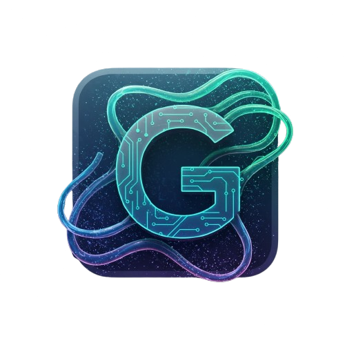

  
  <h1>ChatSearch</h1>
  
<b>ChatGPT answers, right next to your Google results.</b> A Manifest V3 Chrome extension that adds an AI answer panel to Google Search.

  

    
    
    
    
  

---

A **Manifest V3 Chrome extension** that enhances Google Search with ChatGPT: it shows
instant AI answers right beside your normal search results, so you get a direct answer
without leaving the results page.

## Features

- Injects an **AI answer panel** next to Google Search results
- Answers powered by the **OpenAI / ChatGPT API**
- Lightweight **content-script** extension, Manifest V3

## Install (developer mode)

1. Open `chrome://extensions` and enable **Developer mode**.
2. Click **Load unpacked** and select this folder.
3. Run a Google search — the AI panel appears beside the results.

## Tech

JavaScript · Chrome Extension (Manifest V3) · OpenAI API

## License

Released under the [MIT License](LICENSE) © 2026 Olivier Lüthy. You're free to use, modify and distribute this
software, including commercially, as long as the copyright notice and license are included.

## Author

Built by **Olivier Lüthy** — [GitHub](https://github.com/olivierluethy).
